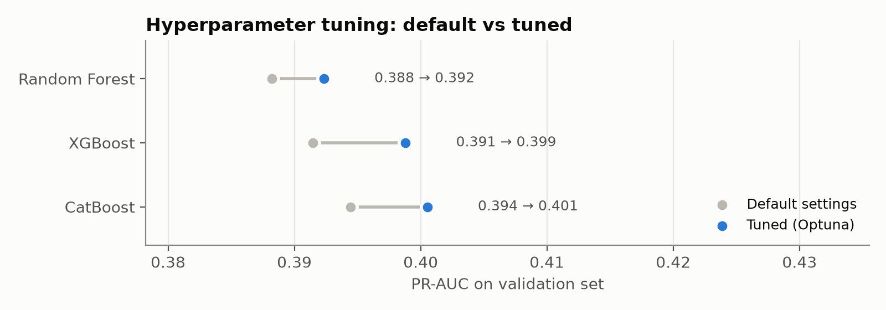
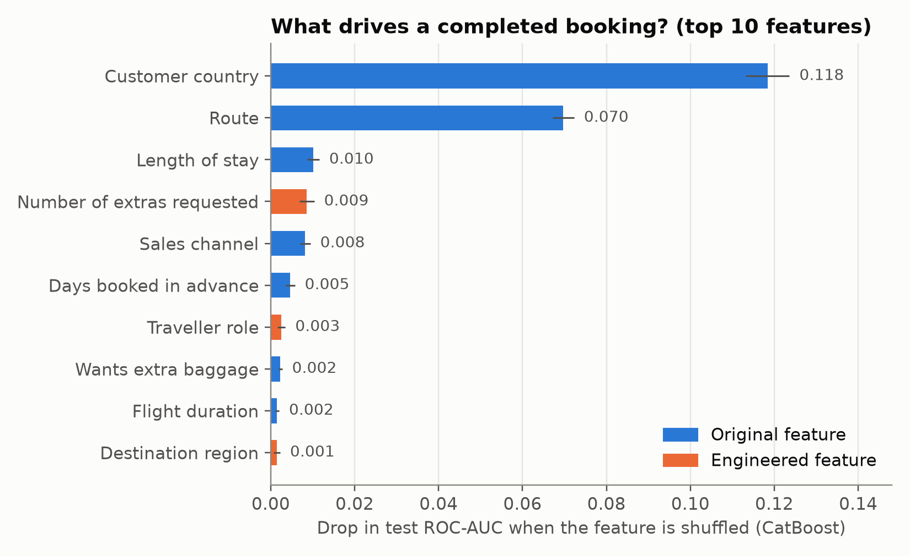
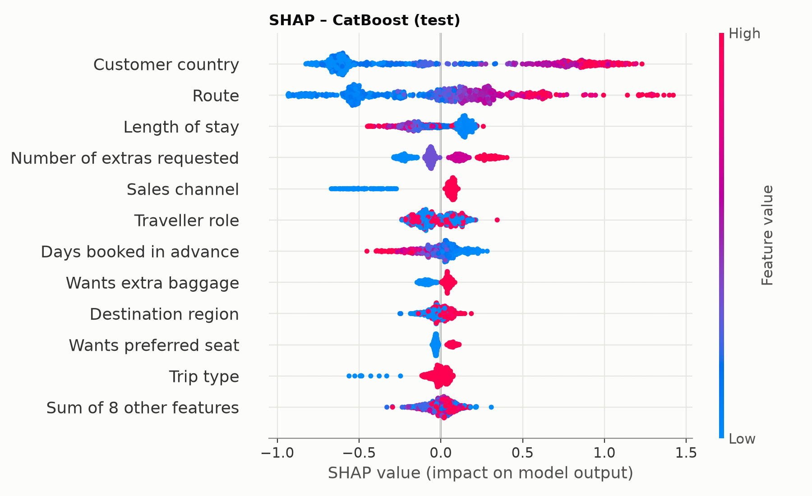

#  British Airways – Data Science Job Simulation (Forage)

Deux cas concrets de data science pour British Airways, réalisés dans le cadre de la simulation virtuelle **British Airways Data Science** sur Forage :

| | Problème business | Approche | Résultat clé |
|---|---|---|---|
| **[Partie 1](#-partie-1--dimensionner-les-salons-daéroport)** | Combien de passagers seront éligibles à chaque salon (Concorde Room, First, Club) sur les futurs plannings ? | Table de correspondance par type de route × région, avec un coefficient horaire | Table réutilisable sur n'importe quel planning futur, avec un repli pour les nouvelles destinations |
| **[Partie 2](#-partie-2--prédire-la-finalisation-dune-réservation)** | Quels clients vont aller au bout de leur réservation, et pourquoi ? | Feature engineering, Random Forest / XGBoost / CatBoost réglés avec Optuna, SHAP | **ROC-AUC de 0,795** sur le test, et **50 % des réservations captées en ciblant 20 % des clients** |

**Stack** : Python · pandas · scikit-learn · XGBoost · CatBoost · Optuna · SHAP · matplotlib · openpyxl · python-pptx

---

##  Partie 1 – Dimensionner les salons d'aéroport

📓 [`PART1/lounge_eligibility.ipynb`](PART1/lounge_eligibility.ipynb) · 📊 [`PART1/final.xlsx`](PART1/final.xlsx)

### Le problème
BA planifie ses salons à Heathrow longtemps à l'avance. Il faut donc estimer la **part de passagers éligibles** à chaque niveau de salon, non pas vol par vol, mais par **groupes de vols réutilisables** :

- **Tier 1** : Concorde Room
- **Tier 2** : First Lounge
- **Tier 3** : Club Lounge

### La démarche
1. **Exploration** d'un planning d'été de 10 000 vols au départ de LHR (avril à octobre 2025).
2. **Comparaison des regroupements possibles** : type de route, région, heure, semaine/week-end, type d'avion.
3. **Groupes retenus : type de route × région**, avec l'heure de la journée comme coefficient multiplicateur. Cela garde peu de groupes.
4. **Groupes de repli** (« autre région » en court et en long-courrier) pour les destinations absentes de l'historique.
5. **Fonction `apply_to_schedule()`** qui applique la table à n'importe quel planning futur.
6. **Remplissage automatique du template Excel** : table de correspondance et justification.

### Résultats

| Groupe | Tier 1 | Tier 2 | Tier 3 |
|---|---|---|---|
| Court-courrier – Europe | 0,34 % | 4,40 % | 16,85 % |
| Long-courrier – Amérique du Nord | 0,20 % | 2,76 % | 10,55 % |
| Long-courrier – Asie | 0,19 % | 2,70 % | 10,35 % |
| Long-courrier – Moyen-Orient | 0,21 % | 2,69 % | 10,29 % |

>  **Les données contredisent l'intuition de départ.** Le sujet suggérait que le long-courrier et les vols du matin auraient plus d'éligibles. En proportion des sièges, c'est l'inverse pour le long-courrier : le court-courrier Europe a la part la plus élevée, car les gros porteurs ajoutent surtout des sièges éco. L'heure de la journée n'a qu'un effet marginal.

---

##  Partie 2 – Prédire la finalisation d'une réservation

 [`PART2/booking_prediction.ipynb`](PART2/booking_prediction.ipynb) ·  [`PART2/booking_prediction_summary.pptx`](PART2/booking_prediction_summary.pptx)

### Le problème
À partir de 50 000 demandes de réservation (canal, route, délai, durée du séjour, options demandées…), prédire si le client va **finaliser sa réservation**, et surtout expliquer **ce qui l'y pousse**. Seules **15 %** des demandes aboutissent : la cible est déséquilibrée.

### La démarche

**1. Préparation sans fuite de données**
- Suppression des 719 doublons.
- `route` (799 valeurs) et `booking_origin` (104 pays) sont encodés par la moyenne de la cible **à l'intérieur du pipeline**, avec du *cross-fitting*.
- Un encodage naïf sur tout le jeu de données gonflait l'AUC à 0,81.

**2. Feature engineering**
- **Variable originale, le « rôle du voyageur »** : les 94 aéroports sont associés à leur pays. On compare ensuite le pays du client au pays de départ et d'arrivée, ce qui donne trois cas : départ de chez soi, retour chez soi ou pays tiers.
- **Autres variables** : nombre d'options demandées, séjour incluant un week-end, réservation de dernière minute, vol de nuit, région de destination.

**3. Protocole d'évaluation rigoureux : 70 % train / 15 % validation / 15 % test (stratifié)**
- **Banc d'essai** : validation croisée en 5 plis des modèles par défaut (régression logistique, Random Forest avec et sans les nouvelles variables, XGBoost).
- **Réglage des hyperparamètres avec Optuna** (65 essais) pour Random Forest, XGBoost et CatBoost. On optimise la **PR-AUC de validation**, adaptée à une cible déséquilibrée, avec arrêt anticipé pour les modèles de boosting.
- **Seuil de décision** choisi sur la validation. **Le test est utilisé une seule fois**, à la fin.

<p align="center"></p>

**4. Interprétation** : importance par permutation sur le test (indépendante du modèle) et valeurs SHAP pour connaître le **sens** de chaque effet.

### Résultats (CatBoost réglé, jeu de test jamais vu)

| ROC-AUC | PR-AUC | F1 | Top 20 % des clients |
|:---:|:---:|:---:|:---:|
| **0,795** | **0,372** (hasard : 0,15) | **0,43** | **50 % des réservations captées** (lift ×2,5) |

<p align="center">
  
  
</p>

### Ce qu'il faut retenir
-  **Le profil du client et sa destination dominent** : le pays du client et la route sont de loin les facteurs principaux. La Malaisie convertit à 35 %, l'Australie, premier marché en volume, à seulement 5 %.
-  **Les voyages courts et proches convertissent mieux** : un séjour long, une réservation très en avance et le canal mobile (11 % contre 15 % sur le web) réduisent la probabilité.
-  **L'engagement est un signal d'achat** : demander les 3 options (bagage, siège, repas) porte la conversion à 19 %, contre 11 % sans option.
-  **Une hypothèse testée honnêtement** : le « rôle du voyageur » montre que les trajets retour convertissent moins (13 % contre 17 %). En revanche, partir de chez soi ne convertit pas mieux que réserver depuis un pays tiers.
-  **La limite vient des données, pas de l'algorithme** : les trois modèles réglés finissent entre 0,793 et 0,795 d'AUC. Le prochain levier serait d'ajouter des données de session (recherches, prix affichés).

### La diapositive pour le manager
<p align="center"></p>

---

##  Lancer le projet

```bash
git clone https://github.com/AmineBnh21/British_Airways_Project.git
cd British_Airways_Project
pip install -r requirements.txt
jupyter notebook
```

Chaque notebook s'exécute depuis son propre dossier (`PART1/` ou `PART2/`). Le notebook de la partie 2 prend environ 20 minutes, principalement pour le réglage avec Optuna.

## 📁 Structure

```
├── PART1/
│   ├── lounge_eligibility.ipynb          # analyse + table d'éligibilité aux salons
│   ├── final.xlsx                        # template Excel complété (table + justification)
│   └── *.xlsx                            # données et template fournis par BA
├── PART2/
│   ├── booking_prediction.ipynb          # EDA, features, modèles, réglage, SHAP
│   ├── booking_prediction_summary.pptx   # synthèse en une diapositive
│   ├── figures/                          # graphiques générés par le notebook
│   ├── customer_booking.csv              # données fournies par BA
│   └── Getting Started.ipynb             # notebook de départ fourni par Forage
└── requirements.txt
```

---

*Projet réalisé dans le cadre de la simulation virtuelle British Airways Data Science sur [Forage](https://www.theforage.com/). Les données sont fournies par Forage à des fins pédagogiques.*
